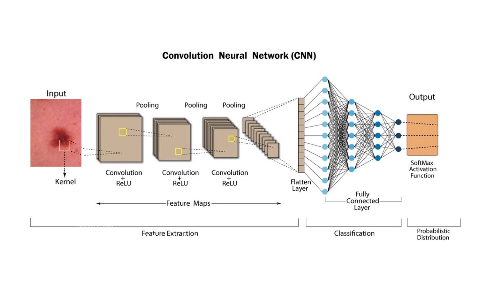
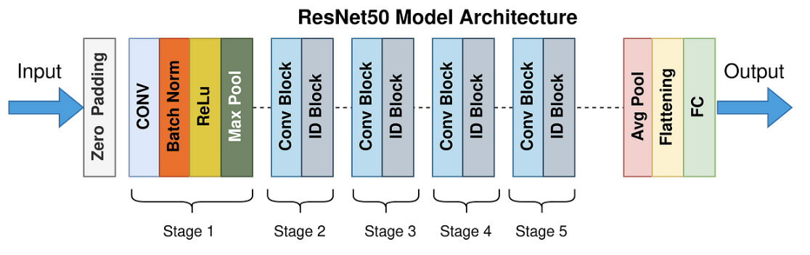
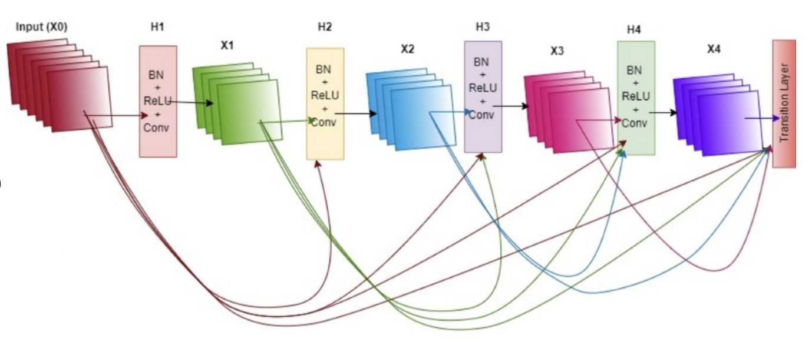
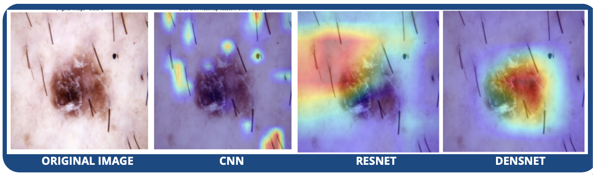

# Custom CNN, ResNet and DenseNet

In these notebooks, we build three different deep learning models for skin lesion classification using the HAM10000 dataset, as already mentioned. For this project, we have implemented and tested the following models, each for balance and imbalance dataset.

## Custom CNN

The first model we implemented is a custom Convolutional Neural Network (CNN) architecture. CNNs are the fundamental architecture for image classification tasks, making them a natural baseline choice for skin lesion analysis. Their key strength lies in their ability to automatically learn hierarchical feature representations from image data by detecting basic features like edges and textures in early layers, while deeper layers identify more complex patterns specific to different types of skin lesions.

Our custom CNN architecture consists of two main parts:

### Convolutional Layers (Feature Extraction)

Starting from 224x224 RGB image, our architecture employed 4 convolutional blocks, each with progressively increasing filter counts.

* 4 convolutional layers, with 3x3 kernels
* Each layer progressively increases the number of filters (64 → 128 → 256 → 512)
* This gradual expansion of feature channels allows the network to learn from simple textures in early layers to complex lesion structures in deeper layers.
* Batch Normalization is applied after each convolutional layer to stabilize activations and improve convergence
* ReLU activation introduces non-linearity, enabling the network to learn complex patterns
* MaxPooling (2x2, stride=2) reduces spatial dimensions while retaining key information, effectively downsampling the feature maps

### Fully Connected Layers (Classification)

After feature extraction, the final feature map (512x14x14) is flattened and passed through:

* FC1: 512x14x14 → 512 neurons - Extracts high-level lesion patterns
* FC2: 512 → 128 neurons - Refines learned representations for better generalization
* FC3: 128 → 7 neurons - Outputs class probabilities for the 7 skin lesion types.

### Hyperparameter Strategy: Tuning with Optuna

To maximize the performance of our CNN model, we implemented a systematic approach to hyperparamer optimization using Optuna, an automated hyperparameter search framework. 

## ResNet (Residual Neural Network)

ResNet - Residual Network - is a deep learning model designed to handle the vanishing gradient problem using skip connections (residual learning). We chose ResNet50, which has 50 layers, pretrained on ImageNet: leverages learned features for faster convergence.

Residual blocks are the core of ResNet's architecture. They consist of:

* Convolutional Blocks: Downsample and capture abstract patterns (irregular borders, color variegation)
* Identity Blocks: Used when input/output dimensions match - refine features like lesion edges/textures without losing resolution
* Skip Connections: Bypass layers by adding the input directly to the output. Instead of forcing each layer to learn a complete transformation, skip connections let the network focus on learning only the differences between layers. This approach solves the vanishing gradient problem, enabling the training of very deep networks.

## DenseNet (Densely Connected Convolutional Network)

This architecture (DenseNet-121) consists of:

* 4 Dense Blocks (feature extraction)
* 3 Transition Blocks (reducing dimensions)

Instead of adding like in ResNet, DenseNet concatenates the outputs of all preceding layers to the input of the current layer. This ensures each layer has direct access to raw features and higher-level features learned by earlier layers. 

**Dense Blocks**:
Layers H1, H2, H3 (with Batch Norm, ReLU, and Convolution) produce feature maps. Each set of feature maps (X1, X2, X3, etc.) is passed along to the next layer, along with all previous feature maps, ensuring maximum resude of information.

It ends with global average pooling to reduce dimensionality and a fully connected layer for classification.

## Explainable AI (XAI): Making Deep Learning Transparent

While deep learning models have shown impressive performance in medical image classification, their "black box" nature has hindered their adoption in clinical settings. Explainable AI (XAI) addresses this critical limitation by providing interpretable insights into how and why AI models make specific decisions.

For this project, we developed a Grad-CAM (Gradient-weighted Class Activation Mapping) visualization technique, inspired by the paper "Dermatologist-like explainable AI enhances trust and confidence in diagnosis melanoma" (), to our three skin lesion classification models. We extract visual heatmaps that highlight the regions in each input image that the models use to make their predictions. Our goal is to enhance our understanding and clarify the validation of the decision-making process for each model, which will ultimately boost transparency and trust in our methods.

### How Grad-CAM Works

The input (in this case the image), passes through convolutional layers, extracting feature maps at each step. Gradients are backpropagated from the predicted class to these feature maps, and a weighted combination of the maps is used to generate a heatmap.

1. Forward Pass: Extract feature maps from target layer.
2. Backward Pass: Compute gradients of predicted class score.
3. Weight Maps: Average gradients to get importance weights.
4. Heatmap: Combine weights and feature maps.
5. Visualize: Overlay heatmap on the original image.

### Example: Grad-CAM Visualization

In this example, comparison shows how different models interpret the same skin lesion using Grad-CAM. the custom CNN lacks clear attention to the lesion, while DenseNet and ResNet focus better on the lesion area. A well-localized heatmap like in ResNet and DenseNet indicates that the AI model is learning clinically significant patterns, making its predictions more interpretable and aligned with dermatologist expertise.

## Final Considerations

Our work demonstrates that combining advanced deep learning architectures with explainability techniques offers a promising path toward AI-assisted dermatological diagnosis that is both accurate and transparent. Looking at the results, we can see that DenseNet and ResNet outperform the custom CNN in terms of accuracy and interpretability, making them more suitable for clinical applications. 

Most importantly, our project highlights that explainability is not merely an add-on but a core requirement for supporting the integration of AI models into clinical workflows. By understanding not just what the model predicts but why it makes those predictions, it can easily build the foundation for AI systems that can truly augment clinical expertise rather than presenting clinicians with inscrutable outputs.

The future of AI in dermatology lies not in replacing human judgment but in providing tools that enhance it through accurate, explainable, and contextually relevan support. Our work represents a step toward this vision of human-AI collaboration in healthcare, where the strengths of both can be harnessed to improve patient outcomes and reduce diagnostic uncertainty.