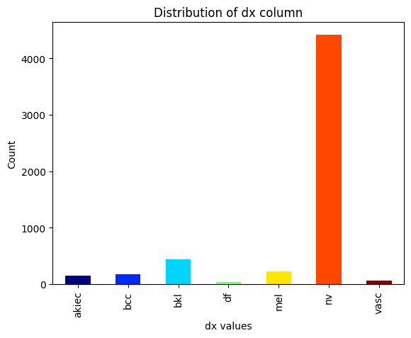
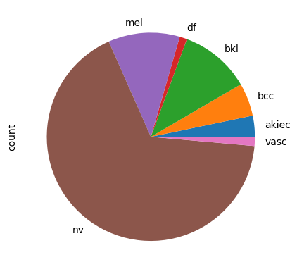

# Deep-Learning-Project
Deep Learning Project - Skin Lesion Classification with Explainability

## Project Overview
This project aims to classify 7 different types of skin lesions using deep learning models. The dataset used in this project is the HAM10000 dataset, with metadata and images of skin lesions.

## General Idea
Clinicians classify skin lesions using multiple methods. The process begins with visual inspection and dermatoscopy, where they examine characteristics like size, shape, color, and subsurface features using specialized magnification tools. For suspicious lesions, histopathological analysis of tissue samples provides detailed cellular information. Modern classification increasingly incorporates advanced imaging systems and AI algorithms, which analyze lesion patterns against databases to support diagnosis. This combined approach enables accurate lesion classification and appropriate treatment planning.

What if we could build a deep learning model that can classify skin lesions with high accuracy and provide explanations for its predictions? This project aims to do just that. By training a deep learning model on the HAM10000 dataset, we can classify skin lesions into 7 different classes and provide explanations for the model's predictions using techniques like Grad-CAM. This project combines the power of deep learning with explainability to create a robust skin lesion classification system.

## About the Project
The project is divided into 3 main parts:
1. EDA and Data Preprocessing
2. Model Building
3. Model Explainability

## EDA and Data Preprocessing
The dataset is first preprocessed to extract the necessary information from the metadata. After combining the metadata with the images, the final dataset used contains 5514 images with 7 different classes of skin lesions, each with information about the patient (age, sex, lesion type, lesion location). 

### Types of Skin Lesions
The dataset contains 7 different types of skin lesions:
1. Melanocytic nevi (`nv`): Commonly known as moles, these benign growths are usually well-defined, round or oval, and can be flat or raised. Their color ranges from flesh-toned to dark brown.
2. Melanoma (`mel`): A malignant tumor originating from melanocytes. Key warning signs include asymmetry, irregular borders, multiple colors, diameter larger than 6mm, and any evolution in size, shape, or color.
3. Benign keratosis-like lesions (`bkl`): This category encompasses seborrheic keratoses, solar lentigines, and lichen-planus-like keratoses. Seborrheic keratoses often have a "stuck-on" appearance with a waxy or wart-like surface. Solar lentigines, commonly known as age spots, are flat, brown patches resulting from sun exposure.
4. Basal cell carcinoma (`bcc`): A common form of skin cancer that rarely metastasizes but can grow destructively if untreated. It appears in different morphologic variants, including flat, nodular, pigmented, and cystic forms.
5. Actinic keratoses (`akiec`): These are rough, scaly patches that develop from prolonged sun exposure and can progress to squamous cell carcinoma. They often feel like sandpaper and may be easier to feel than see.
6. Vascular lesions (`vasc`): This group includes cherry angiomas, angiokeratomas, and pyogenic granulomas. They are typically red or purple due to blood vessel proliferation and can vary in size and shape.
7. Dermatofibroma (`df`): A benign skin lesion that is firm, often brownish, and may show a central zone of fibrosis. They are usually asymptomatic but can be tender when pressed.

### Data Augmentation
The dataset had an imbalanced class distribution. Over-sampling and data augmentation techniques were used to balance the dataset and increase the number of images for each class. The project was implemented using both the original and augmented datasets to compare the model's performance.

## Model Building
The project was implemented using 3 different deep learning models:
1. Convolutional Neural Network (CNN)
2. ResNet (Residual Neural Network)
3. DenseNet (Densely Connected Convolutional Networks)

The models were trained on the dataset and evaluated based on their classification accuracy and performance. 

## Model Explainability
To provide explanations for the model's predictions, the project used the Grad-CAM (Gradient-weighted Class Activation Mapping) technique. Grad-CAM generates a heatmap that highlights the regions of the image that the model used to make its predictions. This technique helps visualize the model's decision-making process and provides insights into why the model classified a skin lesion as a particular class. 

Taking ispiration from the paper [Dermatologist-like explainable AI enhances trust and confidence in diagnosing melanoma](https://www.nature.com/articles/s41467-023-43095-4) (Nature, 2024), we took a look at the Grad-CAM heatmaps generated by the model to understand how the model makes its predictions and what features it focuses on, and how it changes with different models. 

## Conclusion
Of course, the model is not perfect and there is still room for improvement. However, the project demonstrates the potential of deep learning models in skin lesion classification and the importance of model explainability in building trust and confidence in AI-based diagnostic systems. By combining deep learning with explainability techniques like Grad-CAM, we can create robust and transparent skin lesion classification systems that can assist clinicians in diagnosing skin lesions accurately and effectively. 

# References
- [Dermatologist-like explainable AI enhances trust and confidence in diagnosing melanoma](https://www.nature.com/articles/s41467-023-43095-4)
- [HAM10000 dataset](https://dataverse.harvard.edu/dataset.xhtml?persistentId=doi:10.7910/DVN/DBW86T)
- [Grad-CAM: Visual Explanations from Deep Networks via Gradient-Based Localization](https://ieeexplore.ieee.org/document/8237336)
- [Convolutional Neural Networks for Visual Recognition](https://cs231n.github.io/convolutional-networks/)
- [ResNet: Deep Residual Learning for Image Recognition](https://arxiv.org/abs/1512.03385)
- [DenseNet: Densely Connected Convolutional Networks](https://arxiv.org/abs/1608.06993)

<!--
### Sample Images from Each Class
Here are some sample images from each of the 7 classes of skin lesions:

#### Melanocytic nevi (nv)

#### Melanoma (mel)

#### Benign keratosis-like lesions (bkl)

#### Basal cell carcinoma (bcc)

#### Actinic keratoses (akiec)

#### Vascular lesions (vasc)

#### Dermatofibroma (df)

-->